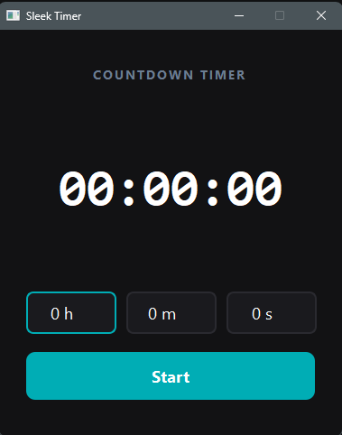

# Python-Timer-App-v2
A countdown timer with a custom dark UI, built with PyQt5

Polished countdown timer with custom dark theme UI, built with PyQt5 and MVVM architecture

## What it does
A countdown timer with hours, minutes, and seconds input. 
Includes start, pause, resume, and reset functionality, 
with inputs locked while the timer is running and a clean 
dark-themed interface.

## How to run
1. Install PyQt5: pip install PyQt5
2. Run: python timer_v2.py

## Built with
- Python
- PyQt5 for the GUI
- MVVM architecture (Model, ViewModel, View)
- Custom QSS styling for a dark theme interface
- State-based UI locking to prevent invalid input during countdown

## What I learned
- Writing custom Qt stylesheets (QSS)
- Managing UI state based on application state
- Improving on an earlier version through iteration
- Designing a more polished, production-feeling interface
